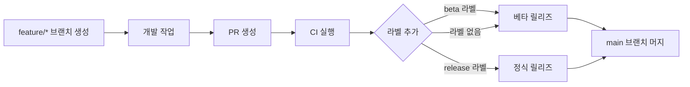

# 🔄 GitHub Flow 기반 워크플로우 가이드

이 문서는 기존 GitFlow 대신 **GitHub Flow**를 사용할 때의 워크플로우 설정과 사용법을 설명합니다.

## 📋 **GitFlow vs GitHub Flow 비교**

| 항목 | GitFlow | GitHub Flow |
|------|---------|-------------|
| **브랜치 구조** | `main`, `dev`, `feature/*`, `hotfix/*`, `release/*` | `main`, `feature/*` |
| **복잡도** | ⚠️ 높음 (5개 브랜치 타입) | ✅ 낮음 (2개 브랜치 타입) |
| **릴리즈 결정** | 브랜치별 자동 결정 | PR 라벨 기반 결정 |
| **워크플로우 파일** | 3개 (cd-dev, cd-main, gitflow-auto-sync) | 1개 (cd-github-flow) |
| **학습 곡선** | ⚠️ 높음 | ✅ 낮음 |
| **유연성** | ⚠️ 낮음 (고정된 규칙) | ✅ 높음 (라벨 기반) |

## 🚀 **GitHub Flow 워크플로우**

### 1. **브랜치 전략**

```
main (기본 브랜치)
├── feature/새기능1
├── feature/새기능2
├── fix/버그수정1
└── hotfix/긴급수정1
```

### 2. **개발 프로세스**



### 3. **릴리즈 결정 방식**

| PR 라벨 | 릴리즈 타입 | 설명 |
|---------|-------------|------|
| `beta` | 베타 릴리즈 | 테스트용 릴리즈 생성 |
| `release` | 정식 릴리즈 | 프로덕션 릴리즈 생성 |
| 라벨 없음 | 베타 릴리즈 | 기본값으로 베타 릴리즈 |

## ⚙️ **GitHub Flow 설정 방법**

### 1. **기존 GitFlow 워크플로우 비활성화**

기존 GitFlow 워크플로우 파일들을 비활성화하거나 삭제:

```bash
# 파일 이름 변경으로 비활성화
mv .github/workflows/cd-dev.yml .github/workflows/cd-dev.yml.disabled
mv .github/workflows/cd-main.yml .github/workflows/cd-main.yml.disabled
mv .github/workflows/gitflow-auto-sync.yml .github/workflows/gitflow-auto-sync.yml.disabled
```

### 2. **GitHub Flow 워크플로우 활성화**

템플릿 파일을 복사하여 활성화:

```bash
# 템플릿을 실제 워크플로우로 복사
cp .github/workflows/cd-github-flow.yml.template .github/workflows/cd-github-flow.yml
```

### 3. **브랜치 보호 규칙 업데이트**

GitHub Repository → Settings → Branches에서:

- ✅ **main 브랜치 보호 규칙 유지**
- ❌ **dev 브랜치 보호 규칙 제거** (더 이상 사용하지 않음)

## 🏷️ **PR 라벨 사용법**

### 1. **베타 릴리즈 생성**

```bash
# PR 생성 시 beta 라벨 추가
gh pr create --title "feat: 새로운 기능 추가" --label "beta"

# 또는 라벨 없이 생성 (기본값으로 베타 릴리즈)
gh pr create --title "feat: 새로운 기능 추가"
```

### 2. **정식 릴리즈 생성**

```bash
# PR 생성 시 release 라벨 추가
gh pr create --title "feat: 새로운 기능 추가" --label "release"
```

### 3. **라벨 추가/변경**

```bash
# 기존 PR에 라벨 추가
gh pr edit 123 --add-label "release"

# 라벨 제거
gh pr edit 123 --remove-label "beta"
```

## 📱 **릴리즈 결과**

### 베타 릴리즈 (`beta` 라벨 또는 라벨 없음)

- **태그 형식**: `v1.0.0-beta.20231201120000`
- **빌드 타입**: Debug APK
- **VERSION_CODE**: 현재 값 유지
- **릴리즈 제목**: "Beta Release v1.0.0-beta.20231201120000"

### 정식 릴리즈 (`release` 라벨)

- **태그 형식**: `v1.0.0`
- **빌드 타입**: Release APK
- **VERSION_CODE**: 자동 증가
- **릴리즈 제목**: "Release v1.0.0"

## 🔧 **버전 관리 규칙**

### 1. **브랜치 타입별 버전 증가**

| 브랜치 타입 | 버전 증가 규칙 | 예시 |
|-------------|----------------|------|
| `feat/*` | Minor 버전 증가 | `v1.0.0` → `v1.1.0` |
| `fix/*`, `hotfix/*` | Patch 버전 증가 | `v1.0.0` → `v1.0.1` |
| 기타 | Patch 버전 증가 | `v1.0.0` → `v1.0.1` |

### 2. **신규 프로젝트 버전**

| 첫 번째 브랜치 타입 | 초기 버전 |
|---------------------|-----------|
| `feat/*` | `v0.1.0` |
| `fix/*`, `hotfix/*` | `v0.0.1` |

## 🚨 **주의사항**

### 1. **라벨 우선순위**

- `release` 라벨이 있으면 **항상 정식 릴리즈**
- `beta`와 `release` 라벨이 모두 있으면 **정식 릴리즈 우선**

### 2. **VERSION_CODE 관리**

- **베타 릴리즈**: VERSION_CODE 변경 없음
- **정식 릴리즈**: VERSION_CODE 자동 증가

### 3. **이전 베타 정리**

- 정식 릴리즈 생성 시 **이전 베타 릴리즈 자동 삭제**
- 베타 릴리즈 생성 시 **같은 버전의 이전 베타 삭제**

## 📚 **실제 사용 예시**

### 시나리오 1: 새 기능 개발 (베타 테스트)

```bash
# 1. 기능 브랜치 생성
git checkout -b feat/user-authentication

# 2. 개발 작업
# ... 코딩 ...

# 3. PR 생성 (베타 릴리즈)
gh pr create --title "feat: 사용자 인증 기능 추가" --label "beta"

# 4. PR 머지 → 베타 릴리즈 자동 생성
# 결과: v1.1.0-beta.20231201120000
```

### 시나리오 2: 정식 릴리즈

```bash
# 1. 기능 브랜치 생성
git checkout -b feat/payment-integration

# 2. 개발 작업
# ... 코딩 ...

# 3. PR 생성 (정식 릴리즈)
gh pr create --title "feat: 결제 시스템 통합" --label "release"

# 4. PR 머지 → 정식 릴리즈 자동 생성
# 결과: v1.2.0 (VERSION_CODE도 자동 증가)
```

### 시나리오 3: 긴급 버그 수정

```bash
# 1. 핫픽스 브랜치 생성
git checkout -b hotfix/critical-bug-fix

# 2. 버그 수정
# ... 수정 작업 ...

# 3. PR 생성 (즉시 정식 릴리즈)
gh pr create --title "hotfix: 결제 오류 수정" --label "release"

# 4. PR 머지 → 정식 릴리즈 자동 생성
# 결과: v1.2.1 (패치 버전 증가)
```

## 🔄 **GitFlow에서 GitHub Flow로 마이그레이션**

### 1. **기존 브랜치 정리**

```bash
# dev 브랜치 삭제 (선택사항)
git branch -d dev
git push origin --delete dev

# 또는 dev 브랜치 유지하고 main과 동기화
git checkout dev
git merge main
git push origin dev
```

### 2. **팀 교육**

- ✅ **브랜치 전략 변경**: `feature/* → main` 만 사용
- ✅ **라벨 사용법**: PR에 `beta` 또는 `release` 라벨 추가
- ✅ **릴리즈 타이밍**: 라벨로 릴리즈 타입 결정

### 3. **점진적 전환**

1. **1단계**: GitHub Flow 워크플로우 추가 (기존과 병행)
2. **2단계**: 팀 교육 및 테스트
3. **3단계**: 기존 GitFlow 워크플로우 비활성화

## 🆚 **언제 어떤 방식을 선택할까?**

### GitHub Flow 추천 상황

- ✅ **작은 팀** (5명 이하)
- ✅ **빠른 배포 주기** (주 1회 이상)
- ✅ **단순한 릴리즈 프로세스** 선호
- ✅ **유연한 릴리즈 타이밍** 필요

### GitFlow 추천 상황

- ✅ **큰 팀** (10명 이상)
- ✅ **정해진 릴리즈 주기** (월 1회 등)
- ✅ **엄격한 릴리즈 프로세스** 필요
- ✅ **복잡한 브랜치 관리** 가능

## 🔧 **문제 해결**

### Q: 라벨을 잘못 설정했을 때?

```bash
# PR 머지 전에 라벨 변경
gh pr edit 123 --remove-label "beta" --add-label "release"
```

### Q: 릴리즈를 취소하고 싶을 때?

```bash
# 릴리즈 삭제
gh release delete v1.0.0

# 태그 삭제
git tag -d v1.0.0
git push origin --delete v1.0.0
```

### Q: VERSION_CODE가 꼬였을 때?

```bash
# Repository Variables에서 수동 수정
# GitHub Repository → Settings → Secrets and variables → Actions → Variables
# VERSION_CODE 값을 원하는 숫자로 변경
```

---

**💡 팁**: GitHub Flow는 단순하지만 강력합니다. 라벨 하나로 릴리즈 타입을 결정할 수 있어 매우 유연한 배포가 가능합니다! 